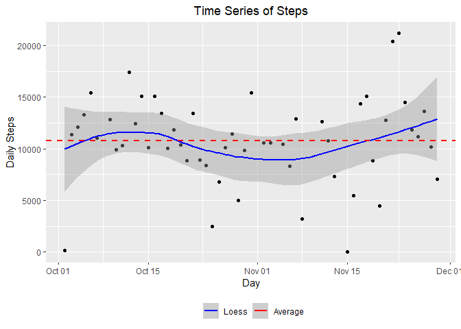
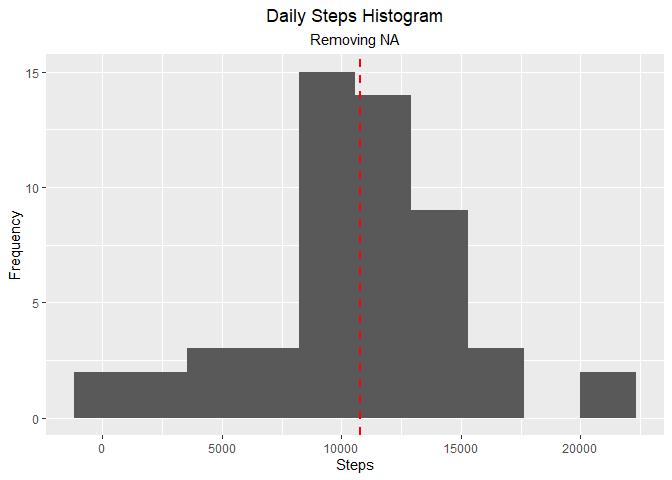
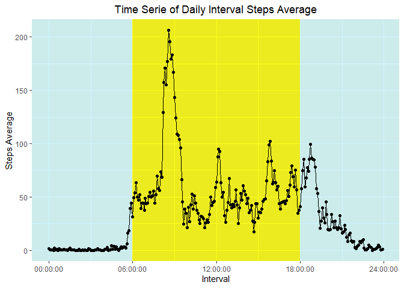
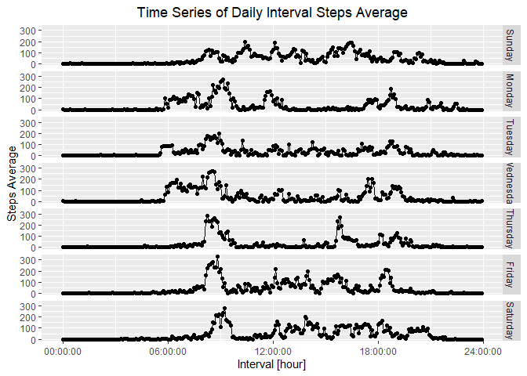
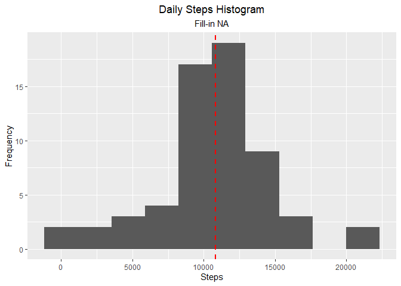
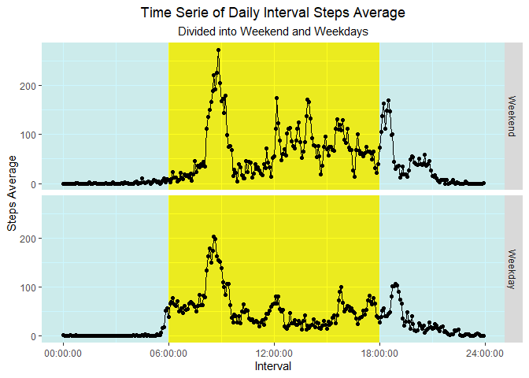

`Course Project 1` Reproducible Research
================

-   👨🏻‍💻 Author: Anderson H Uyekita
-   📚 Specialization: <a
    href="https://www.coursera.org/specializations/data-science-foundations-r"
    target="_blank" rel="noopener">Data Science: Foundations using R
    Specialization</a>
-   📖 Course:
    <a href="https://www.coursera.org/learn/reproducible-research"
    target="_blank" rel="noopener">Reproducible Research</a>
    -   🧑‍🏫 Instructor: Roger D Peng
-   📆 Week 2
    -   🚦 Start: Thursday, 23 June 2022
    -   🏁 Finish: Friday, 24 June 2022
-   🌎 Rpubs: [Interactive
    Document](https://rpubs.com/AndersonUyekita/course-project-1_reproducible-research)

------------------------------------------------------------------------

## Sinopsis

Course Project 1 aims to answer questions and accomplish tasks to create
a Reproducible Research. The dataset used for this assignment is the
`repdata_data_activity.zip`, which has data about personal movement
(steps):

-   279 kBytes (calculate using `pryr` package)
-   3 variables
-   17.568 observations.

The dataset required manipulation to clean the `NA` observation or
define a strategy to deal with it. I have used an approach that
considers the different behavior during the weekdays in its interval.
The result of this imputing was an increase in the mean and median.

In the process of Exploratory Data Analysis, it was possible to identify
that the tracked person has distinct behavior on Mondays, Tuesdays, and
Wednesdays when they wake up early compared to Thursday and Friday, days
they used to wake up at 8 AM. It was also possible to identify that on
Weekends, they do not wake up early nor have intense physical exercises.

Finally, this tracked person used to make almost 11 thousand steps on
average every day.

------------------------------------------------------------------------

## Course Project 1

Course Project 1 has five main tasks, and each task has its own
subtasks:

-   Task 1 – Loading and pre-processing the data;
-   Task 2 – What is mean total number of steps taken per day?;
-   Task 3 – What is the average daily activity pattern?;
-   Task 4 – Imputing missing values;
-   Task 5 – Are there differences in activity patterns between weekdays
    and weekends?.

**Packages Requirements**

It is necessary to install the following packages to reproduce this
Course Project 2.

``` r
# Loading libraries
library(ggplot2)
library(tidyverse)
library(magrittr)
library(kableExtra)
library(stringr)
library(lubridate)
```

Also, those following scripts will use the standard packages from R.

1.  `base`
2.  `graphic`
3.  `utils`
4.  `grDevices`

### Task 1

The **Loading and pre-processing the data** is divided into 2 subtasks:

-   Subtask 1.1. – Load the data, and;
-   Subtask 1.2. – Pre-processing the data.

I have moved the `activity.zip`file to the data folder to make the
repository root tidier.

#### Subtask 1.1.

> Load the data

``` r
# Unzipping the compressed file
utils::unzip(zipfile = "./data/activity.zip",
             overwrite = TRUE,
             exdir = "./data/unzipped", # Extracting the zipped files into the unzipped folder.
             list = FALSE)

# Loading the .csv file
raw_dataset <- utils::read.csv(file = "./data/unzipped/activity.csv",
                               header = TRUE)
```

Following the principles of Exploratory Data Analysis, let’s dig into
this dataset to analyze if it is necessary to make any adjustments. The
first step is to know how many observations and variables this dataset
has.

``` r
# Printing the dimensions.
base::dim(raw_dataset) # Rows Columns
```

    ## [1] 17568     3

The database has 17.568 observations and 3 variables. It is aligned with
the Course Project 1 instructions.

Now, I will check those variables because, according to the assignment
instruction, those variables should be steps, date, and interval.

``` r
# Print the column names.
base::colnames(raw_dataset)
```

    ## [1] "steps"    "date"     "interval"

The dataset has the expected variables and observations.

#### Subtask 1.2.

> Pre-processing the data

Initially, I will display the dataset summary (`summary()`) and then the
structure (`str()`). It is necessary to have a big picture of the data
in each variable because some data could be missing or wrongly
classified/imported.

``` r
# Printing the summary of each variables
summary(raw_dataset)
```

    ##      steps            date              interval     
    ##  Min.   :  0.00   Length:17568       Min.   :   0.0  
    ##  1st Qu.:  0.00   Class :character   1st Qu.: 588.8  
    ##  Median :  0.00   Mode  :character   Median :1177.5  
    ##  Mean   : 37.38                      Mean   :1177.5  
    ##  3rd Qu.: 12.00                      3rd Qu.:1766.2  
    ##  Max.   :806.00                      Max.   :2355.0  
    ##  NA's   :2304

``` r
# Printing the dataset structure.
str(raw_dataset)
```

    ## 'data.frame':    17568 obs. of  3 variables:
    ##  $ steps   : int  NA NA NA NA NA NA NA NA NA NA ...
    ##  $ date    : chr  "2012-10-01" "2012-10-01" "2012-10-01" "2012-10-01" ...
    ##  $ interval: int  0 5 10 15 20 25 30 35 40 45 ...

As warned by the Course Project 1 instructions, the `steps` variable has
2304 `NA` and is classified as an integer, the `date` variable is
wrongly imported as “character”, and the `interval` has no `NA` and is
classified as an integer.

It is necessary two steps:

1.  Removing any observation with `NA`, and;
2.  Converting the `date` column into a date class.

``` r
# STEP 1 - Removing observations with NA.
aux_dataset <- base::subset(x = raw_dataset, !base::is.na(raw_dataset$steps))

# STEP 2 - Converting date column to Date class
tidy_dataset <- aux_dataset %>%
    dplyr::mutate(date = base::as.Date(date))

# Tidy dataset dimensions
base::dim(tidy_dataset)
```

    ## [1] 15264     3

The tidy dataset has 15.264 observations with the same 3 variables.

``` r
# Printing the summary of each variables
summary(tidy_dataset)
```

    ##      steps             date               interval     
    ##  Min.   :  0.00   Min.   :2012-10-02   Min.   :   0.0  
    ##  1st Qu.:  0.00   1st Qu.:2012-10-16   1st Qu.: 588.8  
    ##  Median :  0.00   Median :2012-10-29   Median :1177.5  
    ##  Mean   : 37.38   Mean   :2012-10-30   Mean   :1177.5  
    ##  3rd Qu.: 12.00   3rd Qu.:2012-11-16   3rd Qu.:1766.2  
    ##  Max.   :806.00   Max.   :2012-11-29   Max.   :2355.0

``` r
# Printing the dataset structure.
str(tidy_dataset)
```

    ## 'data.frame':    15264 obs. of  3 variables:
    ##  $ steps   : int  0 0 0 0 0 0 0 0 0 0 ...
    ##  $ date    : Date, format: "2012-10-02" "2012-10-02" ...
    ##  $ interval: int  0 5 10 15 20 25 30 35 40 45 ...

The `interval` variable is recorded weirdly because each observation has
a length of 4. The first two characters represent the hour and the last
two the minutes. I will convert this column into a period class from
`lubridate` package and then to `hms`.

Remember that the original interval has notation based on: “HHMM”. Where
“HH” is related to the hour and “MM” to the minutes.

**Example**

Interval = 2350

It means the gadget has measured the steps between 23:50 and 23:55.

``` r
# Converting interval into Period Class.
tidy_dataset <- tidy_dataset %>%
    mutate(interval = str_pad(interval, 4, pad = "0")) %>%
    mutate(interval = paste0(substr(interval, 1, 2),":",substr(interval, 3, 4),":00")) %>%
    mutate(interval = hms::hms(lubridate::hms(interval))) # The S3 Period time is easier to work on ggplot2.
```

Finally, the tidy dataset has no `NA`, the date column is correctly
classified as a Date class and interval variable is a “time” variable.

``` r
# Presenting the tidy dataset first rows.
head(tidy_dataset) %>%
    kableExtra::kbl() %>%
    kableExtra::kable_styling()
```

<table class="table" style="margin-left: auto; margin-right: auto;">
<thead>
<tr>
<th style="text-align:left;">
</th>
<th style="text-align:right;">
steps
</th>
<th style="text-align:left;">
date
</th>
<th style="text-align:left;">
interval
</th>
</tr>
</thead>
<tbody>
<tr>
<td style="text-align:left;">
289
</td>
<td style="text-align:right;">
0
</td>
<td style="text-align:left;">
2012-10-02
</td>
<td style="text-align:left;">
00:00:00
</td>
</tr>
<tr>
<td style="text-align:left;">
290
</td>
<td style="text-align:right;">
0
</td>
<td style="text-align:left;">
2012-10-02
</td>
<td style="text-align:left;">
00:05:00
</td>
</tr>
<tr>
<td style="text-align:left;">
291
</td>
<td style="text-align:right;">
0
</td>
<td style="text-align:left;">
2012-10-02
</td>
<td style="text-align:left;">
00:10:00
</td>
</tr>
<tr>
<td style="text-align:left;">
292
</td>
<td style="text-align:right;">
0
</td>
<td style="text-align:left;">
2012-10-02
</td>
<td style="text-align:left;">
00:15:00
</td>
</tr>
<tr>
<td style="text-align:left;">
293
</td>
<td style="text-align:right;">
0
</td>
<td style="text-align:left;">
2012-10-02
</td>
<td style="text-align:left;">
00:20:00
</td>
</tr>
<tr>
<td style="text-align:left;">
294
</td>
<td style="text-align:right;">
0
</td>
<td style="text-align:left;">
2012-10-02
</td>
<td style="text-align:left;">
00:25:00
</td>
</tr>
</tbody>
</table>

### Task 2

Task 2 entails about answer the question:

> What is mean total number of steps taken per day?

In addition, there are also 3 subtasks:

-   Subtask 2.1. – Calculate the total number of steps taken per day;
-   Subtask 2.2. – Make a histogram of the total number of steps taken
    each day, and;
-   Subtask 2.3. – Calculate the mean and median of daily steps.

The `tidy_dataset` has lines corresponding to a sample of 5 minutes of
the day. If everything is correct, each day must have 288 observations.

``` r
# Checking if each day has 288 observations.
tidy_dataset %>%
    dplyr::group_by(date) %>%
    dplyr::summarise(obs_day = dplyr::n()) %>%  # Count the number of observations per day.
    dplyr::select(obs_day) %>%
    unique() %>%
    as.numeric()
```

    ## [1] 288

As you can see, all days have the same quantity of observations (288),
allowing me to make further analyses using all observations of
`tidy_dataset`.

#### Subtask 2.1.

> Calculate the total number of steps taken per day

Now, it is necessary to `aggregate` the rows of the same day to
calculate a dataset based on days.

``` r
# Calculating the number of steps in a day.
tidy_dataset_day <- tidy_dataset %>%
    dplyr::group_by(date) %>%
    dplyr::summarise(steps = sum(steps))

# ALTERNATIVE - Using the aggregate function
# tidy_dataset_day <- stats::aggregate(steps ~ date, data = tidy_dataset, FUN = sum)
```

According to the `tidy_dataset` there are 53 days in this dataset, so
the `tidy_dataset_day` must have 53 rows.

``` r
# Number of rows
base::nrow(tidy_dataset_day)
```

    ## [1] 53

The `tidy_dataset_day` has 53 observations and 2 columns (`date` and
`steps`). The scatter plot below will show the distribution of daily
steps between 2012-10-02 and 2012-11-29.

``` r
# Plotting a scatter plot using ggplot2.
ggplot2::ggplot(data = tidy_dataset_day,
                aes(x = date,
                    y = steps)) + 
    
    # Scatter plot
    geom_point() +
    
    # Adding Loess Regression 
    geom_smooth(formula = y ~ x,
                orientation = "x",
                method = 'loess',
                lwd = 0.75,
                aes(color = "Loess")) + 
    
    # Adding a horizontal line to show the Average
    geom_hline(yintercept = mean(tidy_dataset_day$steps),
               linetype = "dashed",
               color = "red",
               lwd = 1,
               aes(color = "Average")) +
    
    # Adding manually the legend.
    scale_color_manual(name = '',
                       breaks = c('Loess', 'Average'),
                       values = c('Loess' = 'blue', 'Average' = 'red')) + 
    
    # Defining the Plot title, x-axis label and y-axis label.
    labs(title = "Time Series of Steps") + 
    xlab(label = "Day") +
    ylab(label = "Daily Steps") +
    
    # Setting legend and title positions.
    theme(legend.position = "bottom",
          plot.title = element_text(hjust = 0.5))
```

<!-- -->

#### Subtask 2.2.

> Make a histogram of the total number of steps taken each day

Based on `tidy_dataset_day`, the histogram below presents the daily
steps habits.

``` r
# Plotting a ggplot2 histogram.
ggplot2::ggplot(data = tidy_dataset_day,
                aes(x = steps)) + 
    
    # Creating a histogram with 10 bins.
    geom_histogram(bins = 10) + 
    
    # Adding the Average
    geom_vline(xintercept = mean(tidy_dataset_day$steps),
               linetype = "dashed",
               color = "red",
               lwd = 1.0,
               aes(color = "Average")) + 
    
    # Defining the Plot title, x-axis label and y-axis label.
    labs(title = "Daily Steps Histogram",
         subtitle = "Removing NA") + 
    xlab(label = "Steps") +
    ylab(label = "Frequency") +
    
    # Setting legend and title positions.
    theme(legend.position = "right",
          plot.title = element_text(hjust = 0.5),
          plot.subtitle = element_text(hjust = 0.5))
```

<!-- -->

According to the above histogram, the most common daily steps varies
between 10.000 and 15.000 thousand steps.

#### Subtask 2.3.

> Calculate the mean and median of daily steps.

The `summary` show the mean and median of daily `steps`.

``` r
# Summary of steps
summary(tidy_dataset_day) %>%
    kableExtra::kbl() %>%
    kableExtra::kable_styling()
```

<table class="table" style="margin-left: auto; margin-right: auto;">
<thead>
<tr>
<th style="text-align:left;">
</th>
<th style="text-align:left;">
date
</th>
<th style="text-align:left;">
steps
</th>
</tr>
</thead>
<tbody>
<tr>
<td style="text-align:left;">
</td>
<td style="text-align:left;">
Min. :2012-10-02
</td>
<td style="text-align:left;">
Min. : 41
</td>
</tr>
<tr>
<td style="text-align:left;">
</td>
<td style="text-align:left;">
1st Qu.:2012-10-16
</td>
<td style="text-align:left;">
1st Qu.: 8841
</td>
</tr>
<tr>
<td style="text-align:left;">
</td>
<td style="text-align:left;">
Median :2012-10-29
</td>
<td style="text-align:left;">
Median :10765
</td>
</tr>
<tr>
<td style="text-align:left;">
</td>
<td style="text-align:left;">
Mean :2012-10-30
</td>
<td style="text-align:left;">
Mean :10766
</td>
</tr>
<tr>
<td style="text-align:left;">
</td>
<td style="text-align:left;">
3rd Qu.:2012-11-16
</td>
<td style="text-align:left;">
3rd Qu.:13294
</td>
</tr>
<tr>
<td style="text-align:left;">
</td>
<td style="text-align:left;">
Max. :2012-11-29
</td>
<td style="text-align:left;">
Max. :21194
</td>
</tr>
</tbody>
</table>

Finally, the daily steps mean and median:

-   Mean: 10766
-   Median: 10765

### Task 3

Task 3 entails about answer the question:

> What is the average daily activity pattern?

In addition, there are also two subtasks:

-   Make a time series plot of the 5-minute interval (x-axis) and the
    average number of steps taken, averaged across all days (y-axis)
-   Which 5-minute interval, on average across all the days in the
    dataset, contains the maximum number of steps?

The `interval` variable is responsible for tracking the daily activity
pattern. For this reason, I will use it to create a new dataset of daily
activity pattern.

``` r
# Calculating the number of steps in a day.
tidy_dataset_day_pattern <- tidy_dataset %>%
    dplyr::group_by(interval) %>%
    dplyr::summarise(steps = mean(steps))

# ALTERNATIVE - Using the aggregate function
# tidy_dataset_day_pattern <- base::aggregate(steps ~ interval, data = tidy_dataset, FUN = sum)
```

Let’s check how is the dataset after the average. I will display the
last rows.

``` r
# Presenting the Daily Pattern last rows.
tail(tidy_dataset_day_pattern) %>%
    kableExtra::kbl() %>%
    kableExtra::kable_styling()
```

<table class="table" style="margin-left: auto; margin-right: auto;">
<thead>
<tr>
<th style="text-align:left;">
interval
</th>
<th style="text-align:right;">
steps
</th>
</tr>
</thead>
<tbody>
<tr>
<td style="text-align:left;">
23:30:00
</td>
<td style="text-align:right;">
2.6037736
</td>
</tr>
<tr>
<td style="text-align:left;">
23:35:00
</td>
<td style="text-align:right;">
4.6981132
</td>
</tr>
<tr>
<td style="text-align:left;">
23:40:00
</td>
<td style="text-align:right;">
3.3018868
</td>
</tr>
<tr>
<td style="text-align:left;">
23:45:00
</td>
<td style="text-align:right;">
0.6415094
</td>
</tr>
<tr>
<td style="text-align:left;">
23:50:00
</td>
<td style="text-align:right;">
0.2264151
</td>
</tr>
<tr>
<td style="text-align:left;">
23:55:00
</td>
<td style="text-align:right;">
1.0754717
</td>
</tr>
</tbody>
</table>

#### Subtask 3.1.

> Make a time series plot of the 5-minute interval (x-axis) and the
> average number of steps taken, averaged across all days (y-axis)

The line plot below presents the average daily steps in each interval.

``` r
# Creating a plotting with line and points
ggplot(data = tidy_dataset_day_pattern) + 
    
    # Early morning period.
    geom_rect(aes(xmin = -Inf,
                  xmax = hms::hms(lubridate::hms("06:00:00")),
                  ymin= -Inf,
                  ymax = Inf), fill = "lightblue", alpha = 0.015) + 
    
    # Daylight period.
    geom_rect(aes(xmin = hms::hms(lubridate::hms("06:00:00")),
                  xmax = hms::hms(lubridate::hms("18:00:00")),
                  ymin= -Inf,
                  ymax = Inf), fill = "yellow", alpha = 0.015) +
    
    # Night time period.
    geom_rect(aes(xmin = hms::hms(lubridate::hms("18:00:00")),
                  xmax = Inf,
                  ymin= -Inf,
                  ymax = Inf), fill = "lightblue", alpha = 0.015) +   
    
    # Adding lines.
    geom_line(aes(x = interval, y = steps)) + 
    
    # Adding points.
    geom_point(aes(x = interval, y = steps)) +
    
    # Defining manually the breaks.
    scale_x_time(breaks = c(hms::hms(lubridate::hms("00:00:00")),
                                           hms::hms(lubridate::hms("06:00:00")),
                                           hms::hms(lubridate::hms("12:00:00")),
                                           hms::hms(lubridate::hms("18:00:00")),
                                           hms::hms(lubridate::hms("24:00:00")))) + 

    # Defining the Plot title, x-axis label and y-axis label.
    labs(title = "Time Serie of Daily Interval Steps Average") + 
    xlab(label = "Interval") +
    ylab(label = "Steps Average") +
    
    # Setting legend and title positions.
    theme(plot.title = element_text(hjust = 0.5))
```

<!-- -->

The person tracked has an explicit behavior to wake up around 5 AM,
between 7 AM and 10 AM has the peak of steps (maybe the commute to
work), around mid-day another rise which could be the trajectory to
lunch.

#### Subtask 3.2.

> Which 5-minute interval, on average across all the days in the
> dataset, contains the maximum number of steps?

Let’s filter the `tidy_dataset_day_pattern` to obtain the highest steps
average and find when it happens.

``` r
# Printing the maximum steps average and the interval what happens.
tidy_dataset_day_pattern %>%
    filter(steps == max(steps)) %>%
    kableExtra::kbl() %>%
    kableExtra::kable_styling()
```

<table class="table" style="margin-left: auto; margin-right: auto;">
<thead>
<tr>
<th style="text-align:left;">
interval
</th>
<th style="text-align:right;">
steps
</th>
</tr>
</thead>
<tbody>
<tr>
<td style="text-align:left;">
08:35:00
</td>
<td style="text-align:right;">
206.1698
</td>
</tr>
</tbody>
</table>

The highest steps average was 206.17, and it occurred at 08:35 AM.

### Task 4

The **Imputing missing values** task implies replacing the `NA` value
with another value instead of removing the entire observation. This
tasks has four subtasks:

-   Calculate and report the total number of missing values in the
    dataset (i.e. the total number of rows with NAs);
-   Devise a strategy for filling in all of the missing values in the
    dataset. The strategy does not need to be sophisticated. For
    example, you could use the mean/median for that day, or the mean for
    that 5-minute interval, etc;
-   Create a new dataset that is equal to the original dataset but with
    the missing data filled in, and;
-   Make a histogram of the total number of steps taken each day and
    Calculate and report the mean and median total number of steps taken
    per day. Do these values differ from the estimates from the first
    part of the assignment? What is the impact of imputing missing data
    on the estimates of the total daily number of steps?

#### Subtask 4.1.

> Calculate and report the total number of missing values in the dataset
> (i.e. the total number of rows with NAs)

It is already answered in Subtask 1.2., however, I will put the
`summary()` one more time.

``` r
# Summary will display an overview of all variables.
summary(raw_dataset)
```

    ##      steps            date              interval     
    ##  Min.   :  0.00   Length:17568       Min.   :   0.0  
    ##  1st Qu.:  0.00   Class :character   1st Qu.: 588.8  
    ##  Median :  0.00   Mode  :character   Median :1177.5  
    ##  Mean   : 37.38                      Mean   :1177.5  
    ##  3rd Qu.: 12.00                      3rd Qu.:1766.2  
    ##  Max.   :806.00                      Max.   :2355.0  
    ##  NA's   :2304

``` r
# Counting the NA number in steps column.
sum(is.na(raw_dataset$steps))
```

    ## [1] 2304

The `steps` variables has 2304 `NA` observations.

#### Subtask 4.2.

> Devise a strategy for filling in all of the missing values in the
> dataset. The strategy does not need to be sophisticated. For example,
> you could use the mean/median for that day, or the mean for that
> 5-minute interval, etc.

Each day of the week has its characteristic for anyone, e.g., sometimes
on Mondays we have to go to the gym, on Tuesdays we usually have
Languages Courses, and so on. Based on it, I have defined my strategy as
calculating an average for each weekday divided into intervals.

First, I have to perform almost the same process as Subtask 1.2., except
not removing the `NA` observations.

``` r
# Creating the Tidy dataset with NA will be updated later, replacing NA with other values.
tidy_dataset_2 <- raw_dataset %>%
    
    # Converting date as Date class.
    dplyr::mutate(date = base::as.Date(date)) %>%
    
    # Adding a new column of Weekdays as a factor.
    mutate(weekday = factor(weekdays(date),
                            levels = c("Sunday", "Monday", "Tuesday", "Wednesday", "Thursday", "Friday", "Saturday"))) %>%
    
    # Manipulating the interval column to convert it as S3 Period.
    mutate(interval = str_pad(interval, 4, pad = "0")) %>%
    mutate(interval = paste0(substr(interval, 1, 2),":",substr(interval, 3, 4),":00")) %>%
    mutate(interval = hms::hms(lubridate::hms(interval)))
```

Now, I will calculate the average steps for each interval divided into
weekdays.

``` r
# Auxiliary Dataset to store the average step for each weekday and interval.
avg_weekday <- tidy_dataset_2 %>%
    group_by(weekday, interval) %>%
    summarise(average = mean(steps,
                             na.rm = TRUE))
```

Based on `avg_weekday`, it is possible to plot a line plot showing the
differences between each weekday.

``` r
# Data manipulation to create new features.
avg_weekday %>%
    
    # Calculating the average of each interval.
    group_by(interval,weekday) %>%
    summarise(steps = mean(average)) %>%
    
    # Creating the ggplot2 graphic.
    ggplot(aes(x = interval,
               y = steps)) + 
    
    # Adding lines.
    geom_line() + 
    
    # Adding points.
    geom_point() + 
    
    # Defining manually the breaks.
    scale_x_time(breaks = c(hms::hms(lubridate::hms("00:00:00")),
                            hms::hms(lubridate::hms("06:00:00")),
                            hms::hms(lubridate::hms("12:00:00")),
                            hms::hms(lubridate::hms("18:00:00")),
                            hms::hms(lubridate::hms("24:00:00")))) + 
    
    # Defining the Plot title, x-axis label and y-axis label.
    labs(title = "Time Series of Daily Interval Steps Average") + 
    xlab(label = "Interval [hour]") +
    ylab(label = "Steps Average") +
    
    # Setting legend and title positions.
    theme(plot.title = element_text(hjust = 0.5)) + 
    
    # Creating facets to show weekdays differences.
    facet_grid(rows = vars(weekday))
```

<!-- -->

The tracked person has recorded activities since 6 AM on Monday,
Tuesday, and Wednesday. On all other days, they start to record actions
from 8 AM.

Just for curiosity, I want to know from those `NA` observations, how is
the distribution between weekdays?

``` r
# Counting days with no observations.
tidy_dataset_2 %>%
    group_by(weekday) %>%
    summarise(days = sum(is.na(steps))/288)
```

    ## # A tibble: 7 x 2
    ##   weekday    days
    ##   <fct>     <dbl>
    ## 1 Sunday        1
    ## 2 Monday        2
    ## 3 Tuesday       0
    ## 4 Wednesday     1
    ## 5 Thursday      1
    ## 6 Friday        2
    ## 7 Saturday      1

As you can see, there is no concentration of `NA` on a single weekday.

#### Subtask 4.3.

> Create a new dataset that is equal to the original dataset but with
> the missing data filled in.

Following the strategy defined in Subtask 4.2., I need to `merge()` two
datasets: `tidy_dataset_2` and `avg_weekday`, then I may fill in `NA`
using the `coalesce()` function.

``` r
# Merging datasets using two keys.
merge(x = tidy_dataset_2,
      y = avg_weekday,
      by = c("interval", "weekday")) %>%
    
    # Arranging the dataset to be on crescent time.
    arrange(date) %>%
    
    # Fill in NA by average of each weekday and interval.
    mutate(steps = coalesce(steps, average)) -> tidy_dataset_2
```

Checking if all `NA` is replaced with average.

``` r
# Checking NA
sum(is.na(tidy_dataset_2$steps))
```

    ## [1] 0

According to `summary()` there’s no `NA` in interval column.

#### Subtask 4.4.

> Make a histogram of the total number of steps taken each day and
> Calculate and report the mean and median total number of steps taken
> per day. Do these values differ from the estimates from the first part
> of the assignment? What is the impact of imputing missing data on the
> estimates of the total daily number of steps?

The code below will display a histogram using the dataset with `NA`
fill-in.

``` r
# Calculating the summation of steps in a day.
tidy_dataset_2 %>% group_by(date) %>%
    summarise(steps = sum(steps)) -> tidy_dataset_aggregate

# Plotting a ggplot2 histogram.
ggplot2::ggplot(data = tidy_dataset_aggregate,
                aes(x = steps)) + 
    
    # Creating a histogram with 10 bins.
    geom_histogram(bins = 10) + 
    
    # Adding the Average
    geom_vline(xintercept = mean(tidy_dataset_aggregate$steps),
               linetype = "dashed",
               color = "red",
               lwd = 1.0,
               aes(color = "Average")) + 
    
    # Defining the Plot title, x-axis label and y-axis label.
    labs(title = "Daily Steps Histogram",
         subtitle = "Fill-in NA") + 
    xlab(label = "Steps") +
    ylab(label = "Frequency") +
    
    # Setting legend and title positions.
    theme(legend.position = "right",
          plot.title = element_text(hjust = 0.5),
          plot.subtitle = element_text(hjust = 0.5))
```

<!-- -->

Let’s check the new values of the mean and median after the fill-in
process.

``` r
summary(tidy_dataset_aggregate)
```

    ##       date                steps      
    ##  Min.   :2012-10-01   Min.   :   41  
    ##  1st Qu.:2012-10-16   1st Qu.: 8918  
    ##  Median :2012-10-31   Median :11015  
    ##  Mean   :2012-10-31   Mean   :10821  
    ##  3rd Qu.:2012-11-15   3rd Qu.:12811  
    ##  Max.   :2012-11-30   Max.   :21194

The mean and median from fill-in `NA` and removed `NA` are different.
The table below presents the difference between those results.

<table class="table" style="margin-left: auto; margin-right: auto;">
<thead>
<tr>
<th style="text-align:left;">
</th>
<th style="text-align:right;">
Removing NA
</th>
<th style="text-align:right;">
Fill-in NA
</th>
</tr>
</thead>
<tbody>
<tr>
<td style="text-align:left;">
mean
</td>
<td style="text-align:right;">
10766.19
</td>
<td style="text-align:right;">
10821.21
</td>
</tr>
<tr>
<td style="text-align:left;">
median
</td>
<td style="text-align:right;">
10765.00
</td>
<td style="text-align:right;">
11015.00
</td>
</tr>
</tbody>
</table>

The fill-in `NA` impact was a mean and median slightly higher.

### Task 5

> Are there differences in activity patterns between weekdays and
> weekends?

Task 5 aims to find patterns in the dataset, and it is divided into two
subtasks:

-   Create a new factor variable in the dataset with two levels –
    “weekday” and “weekend” indicating whether a given date is a weekday
    or weekend day, and;
-   Make a panel plot containing a time series plot (i.e. type = “l”) of
    the 5-minute interval (x-axis) and the average number of steps
    taken, averaged across all weekday days or weekend days (y-axis).
    See the README file in the GitHub repository to see an example of
    what this plot should look like using simulated data.

#### Subtask 5.1.

> Create a new factor variable in the dataset with two levels –
> “weekday” and “weekend” indicating whether a given date is a weekday
> or weekend day.

Following the Course Project 1 instructions, I need to create a new
column storing the info about `Weekend` or `Weekday`.

``` r
# Adding a new variable about weekend or weeday.
tidy_dataset_2 %>%
    mutate(day_type = case_when(
        weekday %in% c("Friday", "Saturday") ~ factor("Weekend", levels = c("Weekend", "Weekday")),
        !(weekday %in% c("Friday", "Saturday")) ~ factor("Weekday", levels = c("Weekend", "Weekday")))) -> tidy_dataset_2
```

Let’s see the new variable called `day_type`:

<table class="table" style="margin-left: auto; margin-right: auto;">
<thead>
<tr>
<th style="text-align:left;">
interval
</th>
<th style="text-align:left;">
weekday
</th>
<th style="text-align:right;">
steps
</th>
<th style="text-align:left;">
date
</th>
<th style="text-align:right;">
average
</th>
<th style="text-align:left;">
day_type
</th>
</tr>
</thead>
<tbody>
<tr>
<td style="text-align:left;">
00:00:00
</td>
<td style="text-align:left;">
Monday
</td>
<td style="text-align:right;">
1.428571
</td>
<td style="text-align:left;">
2012-10-01
</td>
<td style="text-align:right;">
1.428571
</td>
<td style="text-align:left;">
Weekday
</td>
</tr>
<tr>
<td style="text-align:left;">
00:05:00
</td>
<td style="text-align:left;">
Monday
</td>
<td style="text-align:right;">
0.000000
</td>
<td style="text-align:left;">
2012-10-01
</td>
<td style="text-align:right;">
0.000000
</td>
<td style="text-align:left;">
Weekday
</td>
</tr>
<tr>
<td style="text-align:left;">
00:10:00
</td>
<td style="text-align:left;">
Monday
</td>
<td style="text-align:right;">
0.000000
</td>
<td style="text-align:left;">
2012-10-01
</td>
<td style="text-align:right;">
0.000000
</td>
<td style="text-align:left;">
Weekday
</td>
</tr>
<tr>
<td style="text-align:left;">
00:15:00
</td>
<td style="text-align:left;">
Monday
</td>
<td style="text-align:right;">
0.000000
</td>
<td style="text-align:left;">
2012-10-01
</td>
<td style="text-align:right;">
0.000000
</td>
<td style="text-align:left;">
Weekday
</td>
</tr>
<tr>
<td style="text-align:left;">
00:20:00
</td>
<td style="text-align:left;">
Monday
</td>
<td style="text-align:right;">
0.000000
</td>
<td style="text-align:left;">
2012-10-01
</td>
<td style="text-align:right;">
0.000000
</td>
<td style="text-align:left;">
Weekday
</td>
</tr>
<tr>
<td style="text-align:left;">
00:25:00
</td>
<td style="text-align:left;">
Monday
</td>
<td style="text-align:right;">
5.000000
</td>
<td style="text-align:left;">
2012-10-01
</td>
<td style="text-align:right;">
5.000000
</td>
<td style="text-align:left;">
Weekday
</td>
</tr>
</tbody>
</table>

Finally, following the instruction, the new variable `data type` is a
factor.

``` r
# Checking the new variable. It must be a factor.
str(tidy_dataset_2)
```

    ## 'data.frame':    17568 obs. of  6 variables:
    ##  $ interval: 'hms' num  00:00:00 00:05:00 00:10:00 00:15:00 ...
    ##   ..- attr(*, "units")= chr "secs"
    ##  $ weekday : Factor w/ 7 levels "Sunday","Monday",..: 2 2 2 2 2 2 2 2 2 2 ...
    ##  $ steps   : num  1.43 0 0 0 0 ...
    ##  $ date    : Date, format: "2012-10-01" "2012-10-01" ...
    ##  $ average : num  1.43 0 0 0 0 ...
    ##  $ day_type: Factor w/ 2 levels "Weekend","Weekday": 2 2 2 2 2 2 2 2 2 2 ...

#### Subtask 5.2.

> Make a panel plot containing a time series plot (i.e. type = “l”) of
> the 5-minute interval (x-axis) and the average number of steps taken,
> averaged across all weekday days or weekend days (y-axis). See the
> README file in the GitHub repository to see an example of what this
> plot should look like using simulated data.

Creating a plot line with two panels: Weekend and Weekdays.

``` r
# Calculating the mean of all weekends days and weekdays.
tidy_dataset_2 %>% 
    group_by(interval, day_type) %>%
    summarise(steps = mean(steps)) %>%

    # Plotting a geom_line e geom_poiny.
ggplot(aes(x = interval, y = steps)) + 
    
        # Early morning period.
    geom_rect(aes(xmin = -Inf,
                  xmax = hms::hms(lubridate::hms("06:00:00")),
                  ymin= -Inf,
                  ymax = Inf), fill = "lightblue", alpha = 0.015) + 
    
    # Daylight period.
    geom_rect(aes(xmin = hms::hms(lubridate::hms("06:00:00")),
                  xmax = hms::hms(lubridate::hms("18:00:00")),
                  ymin= -Inf,
                  ymax = Inf), fill = "yellow", alpha = 0.015) +
    
    # Night time period.
    geom_rect(aes(xmin = hms::hms(lubridate::hms("18:00:00")),
                  xmax = Inf,
                  ymin= -Inf,
                  ymax = Inf), fill = "lightblue", alpha = 0.015) + 
    
    geom_point() + 
    
    geom_line() + 
    
    # Defining manually the breaks.
    scale_x_time(breaks = c(hms::hms(lubridate::hms("00:00:00")),
                                           hms::hms(lubridate::hms("06:00:00")),
                                           hms::hms(lubridate::hms("12:00:00")),
                                           hms::hms(lubridate::hms("18:00:00")),
                                           hms::hms(lubridate::hms("24:00:00")))) + 
    
    # Defining the Plot title, x-axis label and y-axis label.
    labs(title = "Time Serie of Daily Interval Steps Average",
         subtitle = "Divided into Weekend and Weekdays") + 
    xlab(label = "Interval") +
    ylab(label = "Steps Average") + 
    
    # Setting legend and title positions.
    theme(plot.title = element_text(hjust = 0.5),
          plot.subtitle = element_text(hjust = 0.5)) + 
    
    # Creating the facet grid by weekdays and weekend.
    facet_grid(rows = vars(day_type))
```

<!-- -->

During the weekdays, the user has a different daily routine. For
example, on Weekends, they wake up later and tend to be less active.
However, we have already dug into the weekdays and found out the user is
more active on Monday, Tuesday, and Wednesday, as presented in Subtask
4.2..
