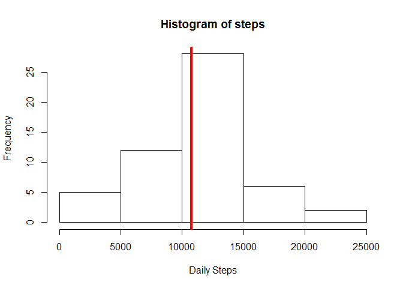
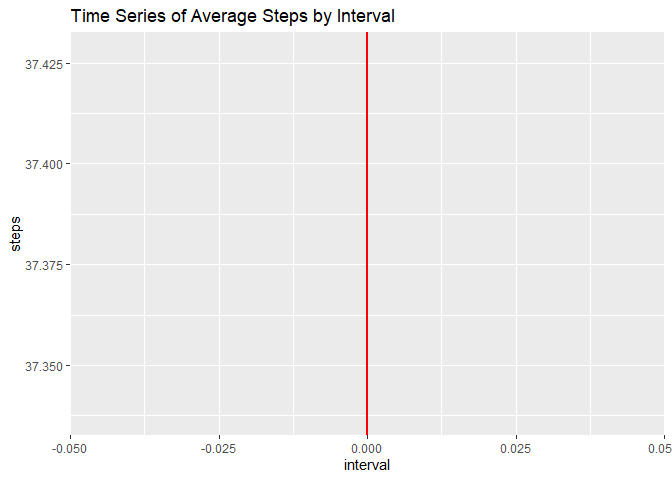
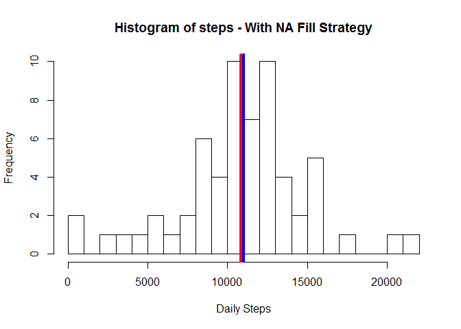
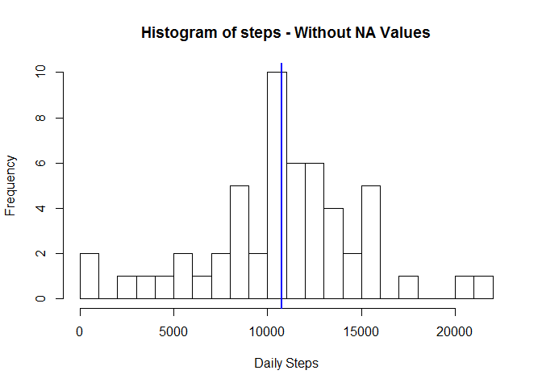
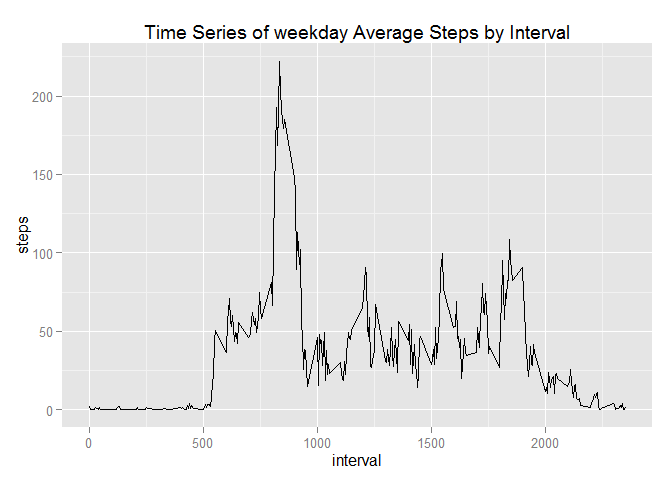
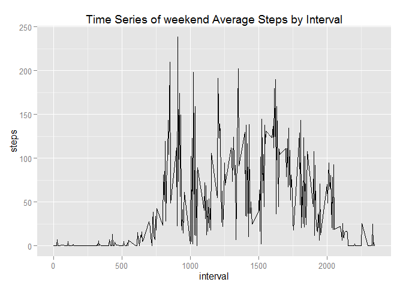

# Reproducible Research: Peer Assessment 1

This assignment was divided into 5 sections:

1. Loading and preprocessiong the data;
2. Question 1: What is mean total number of steps taken per day?;
3. Question 2: What is the average daily activity pattern?;
4. Imputing missing values;
5. Question 3: Are there differences in activity patterns between weekdays and weekends?.


## Loading and preprocessing the data
Suppose that you already fetched the repository to the local machine and stored all files into "Documents/RepoData"


```r
# Loading libraries
library(ggplot2)
library(dplyr)
```

```
## 
## Attaching package: 'dplyr'
## 
## The following objects are masked from 'package:stats':
## 
##     filter, lag
## 
## The following objects are masked from 'package:base':
## 
##     intersect, setdiff, setequal, union
```

```r
# Force results to be in English
Sys.setlocale("LC_ALL","English")
```

```
## [1] "LC_COLLATE=English_United States.1252;LC_CTYPE=English_United States.1252;LC_MONETARY=English_United States.1252;LC_NUMERIC=C;LC_TIME=English_United States.1252"
```

```r
# Unzipping the compressed file
unzip("activity.zip", list = FALSE, overwrite = TRUE)

# Loading the .csv file to the raw dataset
raw_dataset <- read.csv("activity.csv")
```

The first 5 lines of `raw_dataset`:


```r
head(raw_dataset,5)
```

```
##   steps       date interval
## 1    NA 2012-10-01        0
## 2    NA 2012-10-01        5
## 3    NA 2012-10-01       10
## 4    NA 2012-10-01       15
## 5    NA 2012-10-01       20
```

Summary of each variable:


```r
summary(raw_dataset)
```

```
##      steps                date          interval     
##  Min.   :  0.00   2012-10-01:  288   Min.   :   0.0  
##  1st Qu.:  0.00   2012-10-02:  288   1st Qu.: 588.8  
##  Median :  0.00   2012-10-03:  288   Median :1177.5  
##  Mean   : 37.38   2012-10-04:  288   Mean   :1177.5  
##  3rd Qu.: 12.00   2012-10-05:  288   3rd Qu.:1766.2  
##  Max.   :806.00   2012-10-06:  288   Max.   :2355.0  
##  NA's   :2304     (Other)   :15840
```

Type of variable:


```r
# Using the class() function to get the type of each variable
steps_type <- class(raw_dataset$steps)
date_type <- class(raw_dataset$date)
interval_type <- class(raw_dataset$interval)
```

* steps: integer
* date: factor
* interval: integer

Fixing the `date` variable to became `as.Date`.


```r
raw_dataset$date <- as.Date(raw_dataset$date)
date_type <- class(raw_dataset$date)
```

Now the date variable `date` is Date type.

Eliminating the `NA` values:

```r
# Selection Vector used to eliminate rows with NA steps.
selection_rows <- complete.cases(raw_dataset)

# Cleaned dataset
dataset <- raw_dataset[selection_rows,TRUE]
```

The first 5 lines of the cleaned dataset:

```r
head(dataset,5)
```

```
##     steps       date interval
## 289     0 2012-10-02        0
## 290     0 2012-10-02        5
## 291     0 2012-10-02       10
## 292     0 2012-10-02       15
## 293     0 2012-10-02       20
```

## What is mean total number of steps taken per day?

1. The `dataset` has lines that correspond to a sample of a 5 minutes of the day. It is necessary to `aggregate` the rows with the same day to calculate the average of steps.


```r
# The aggregate function was used to sum steps of the same day
dataset_aggregate <- aggregate(steps ~ date, data = dataset, FUN = sum)

# The first 5 lines of the aggregate dataset
head(dataset_aggregate,5)
```

```
##         date steps
## 1 2012-10-02   126
## 2 2012-10-03 11352
## 3 2012-10-04 12116
## 4 2012-10-05 13294
## 5 2012-10-06 15420
```

The barplot below shows the evolution of `steps` between 2012-10-02 and 2012-11-29. This graphic intend to show the `step` variation during the period day by day.


```r
# temporal historic of step using barplot
barplot(dataset_aggregate$steps, names.arg = dataset_aggregate$date, xlab = "date", ylab = "steps",main =  "Temporal serie of steps")

# Mean
average_steps <- mean(dataset_aggregate$steps)

# Horizontal red line to show the step average
abline(h = average_steps,col="red",lwd=4)
```

 

2. The the `steps` histogram is show below. This histogram intend to show the frequency of daily `steps`, what is the most comom and what is exceptions.


```r
# Plot the histogram
hist(dataset_aggregate$steps, main = "Histogram of steps",xlab = 'Daily Steps', ylab = 'Frequency',breaks = 10)

# Vertical line to show the step average
abline(v = average_steps,col="red",lwd=4)
```

 

The `summary` show the mean and median of `steps`.

```r
# Summary of steps
summary(dataset_aggregate$steps)
```

```
##    Min. 1st Qu.  Median    Mean 3rd Qu.    Max. 
##      41    8841   10760   10770   13290   21190
```

```r
# Results
mean_step <- summary(dataset_aggregate$steps)['Mean']
median_step <- summary(dataset_aggregate$steps)['Median']
```

3. Results:
* Mean = 10770
* Median = 10760

## What is the average daily activity pattern?

Analog of the above implementation, instead of day this question ask to `aggregate` by interval.


```r
# The aggregate function was used to "mean" steps of the same interval
dataset_aggregate_interval <- aggregate(steps ~ interval, data = dataset, FUN = mean)

# The first 5 lines of the interval aggregate dataset
head(dataset_aggregate_interval,5)
```

```
##   interval     steps
## 1        0 1.7169811
## 2        5 0.3396226
## 3       10 0.1320755
## 4       15 0.1509434
## 5       20 0.0754717
```

The Time serie of Average Steps by Intreval


```r
# Maximum Average by Interval
max_step_average_interval <- max(dataset_aggregate_interval$steps)

# When the max occurs
interval_max_average <- dataset_aggregate_interval[dataset_aggregate_interval$steps == max_step_average_interval,TRUE]$interval

# Line graphic to show the time serie of average step by interval and the red vertical line to mark the maximum average step
ggplot(dataset_aggregate_interval,aes(interval,steps))+
        ggtitle("Time Series of Average Steps by Interval") +
        geom_line() +
        geom_vline(xintercept = interval_max_average , colour = "red" , size = 1)
```

 

The maximum average step by interval is 206.1698113 and it is occurs during the interval 835

## Imputing missing values

Summary the `raw_data`:

```r
summary(raw_dataset)
```

```
##      steps             date               interval     
##  Min.   :  0.00   Min.   :2012-10-01   Min.   :   0.0  
##  1st Qu.:  0.00   1st Qu.:2012-10-16   1st Qu.: 588.8  
##  Median :  0.00   Median :2012-10-31   Median :1177.5  
##  Mean   : 37.38   Mean   :2012-10-31   Mean   :1177.5  
##  3rd Qu.: 12.00   3rd Qu.:2012-11-15   3rd Qu.:1766.2  
##  Max.   :806.00   Max.   :2012-11-30   Max.   :2355.0  
##  NA's   :2304
```

Number of `NA` values in `steps`:

```r
NA_steps <- summary(raw_dataset$steps)["NA's"]
```
* There are 2304 intervals with `NA` value.

The strategy to fill the `NA` is based on steps average for each weekday.

```r
# Using the dplyr package
dataset_aggregate <- tbl_df(dataset_aggregate)

# Adding a new column to keep the weekday
dataset_aggregate <- mutate(dataset_aggregate,weekday = weekdays(dataset_aggregate$date))

# Saving weekdays
weekdays_dataset <- unique(dataset_aggregate$weekday)

# One average for each weekday 
mean_weekday <- vector()
for (i in 1:length(weekdays_dataset) ) {
        filter_dataset_aggregate <- filter(dataset_aggregate,weekday == weekdays_dataset[i])$steps
        
        mean_weekday[i] <- mean(filter_dataset_aggregate)
        
}

names(mean_weekday) <- c(weekdays_dataset)
```

Each weekday mean that will be used to fill `NA` values:


```r
# Mean by interval
mean_weekday <- mean_weekday/288

mean_weekday
```

```
##   Tuesday Wednesday  Thursday    Friday  Saturday    Sunday    Monday 
##  31.07485  40.94010  28.51649  42.91567  43.52579  42.63095  34.63492
```

Substituing the `NA` with the `mean_weekday` values.


```r
# Transforming the regular dataframe into a dplyr table
raw_dataset_NA_replace <- tbl_df(raw_dataset)

# Mutate the raw_dataset to insert a new column of weekday
raw_dataset_NA_replace <- mutate(raw_dataset_NA_replace,weekday = weekdays(raw_dataset_NA_replace$date))

# Loop to check each row
for (j in weekdays_dataset) {
        raw_dataset_NA_replace <- mutate(raw_dataset_NA_replace,
                              steps = ifelse(test = ( (weekday == j) & (is.na(steps) == TRUE) ),
                                             yes = mean_weekday[[j]] ,
                                             no = steps ) )
        }
```

Comparison with cleaned dataset and dataset with `NA` values replace by strategy adopth.


```r
# The aggregate function was used to sum steps of the same day
dataset_aggregate_NA_replace <- aggregate(steps ~ date, data = raw_dataset_NA_replace, FUN = sum)

# Plot the histogram with NA values replaced regarding the strategy
hist(dataset_aggregate_NA_replace$steps, main = "Histogram of steps - With NA Fill Strategy",
     xlab = 'Daily Steps', ylab = 'Frequency',breaks = 20)

# Red Vertical line to show the step average with NA values replaced regarding the strategy
abline(v = mean(dataset_aggregate_NA_replace$steps),col="red",lwd=4)

# Blue Vertical line to show the step median with NA values replaced regarding the strategy
abline(v = median(dataset_aggregate_NA_replace$steps),col="blue",lwd=4)
```

 

```r
# Plot the histogram without NA values
hist(dataset_aggregate$steps, main = "Histogram of steps - Without NA Values",
     xlab = 'Daily Steps', ylab = 'Frequency',breaks = 20)

# Red Vertical line to show the step average without NA values
abline(v = mean(dataset_aggregate$steps),col="red",lwd=2)

# Blue Vertical line to show the step average without NA values
abline(v = median(dataset_aggregate$steps),col="blue",lwd=2)
```

 

The `summary` show the mean and median of `steps` after replace all `NA` values by the strategy adopt.

```r
summary(dataset_aggregate_NA_replace$steps)
```

```
##    Min. 1st Qu.  Median    Mean 3rd Qu.    Max. 
##      41    8918   11020   10820   12810   21190
```

Comparison before and after replace `NA` values.

```r
# Comparison Table
rbind('Weekday Strategy' = summary(dataset_aggregate_NA_replace$steps),
      'Without NA' = summary(dataset_aggregate$steps))[,3:4]
```

```
##                  Median  Mean
## Weekday Strategy  11020 10820
## Without NA        10760 10770
```

The median and mean seems to be are much closer with the strategy adopt to fill `NA` values. This table confirms the slight variation observed in the last two histogram.

## Are there differences in activity patterns between weekdays and weekends?

Creating a new factor to the raw dataset.

```r
# Creating a tbl_df()
raw_dataset_new_factor <- tbl_df(raw_dataset)

# Mutate the table base on weekday and weekend using the ifelse() function
raw_dataset_new_factor <- mutate(raw_dataset_new_factor,
                                New_factor = ifelse(test = weekdays(raw_dataset_new_factor$date) == c('Saturday','Sunday'), 
                                                    yes = 'weekend', 
                                                    no = 'weekday'))
```

Make a panel plot containing a time series plot (i.e. `type = "l"`) of the 5-minute interval (x-axis) and the average number of steps taken, averaged across all weekday days or weekend days (y-axis). See the README file in the GitHub repository to see an example of what this plot should look like using simulated data.


```r
dataset_weekday <- filter(raw_dataset_new_factor,New_factor == "weekday")

dataset_weekday_aggregate <- aggregate(steps ~ interval, data = dataset_weekday, FUN = mean)

dataset_weekend <- filter(raw_dataset_new_factor,New_factor == "weekend")

dataset_weekend_aggregate <- aggregate(steps ~ interval, data = dataset_weekend, FUN = mean)


# Line graphic to show the time serie of average step by interval and the red vertical line to mark the maximum average step
g1 <- ggplot(dataset_weekday_aggregate,aes(interval,steps))+
        ggtitle("Time Series of weekday Average Steps by Interval") +
        geom_line()

# Line graphic to show the time serie of average step by interval and the red vertical line to mark the maximum average step
g2 <- ggplot(dataset_weekend_aggregate,aes(interval,steps))+
        ggtitle("Time Series of weekend Average Steps by Interval") +
        geom_line()

print(g1)
```

 

```r
print(g2)
```

 


