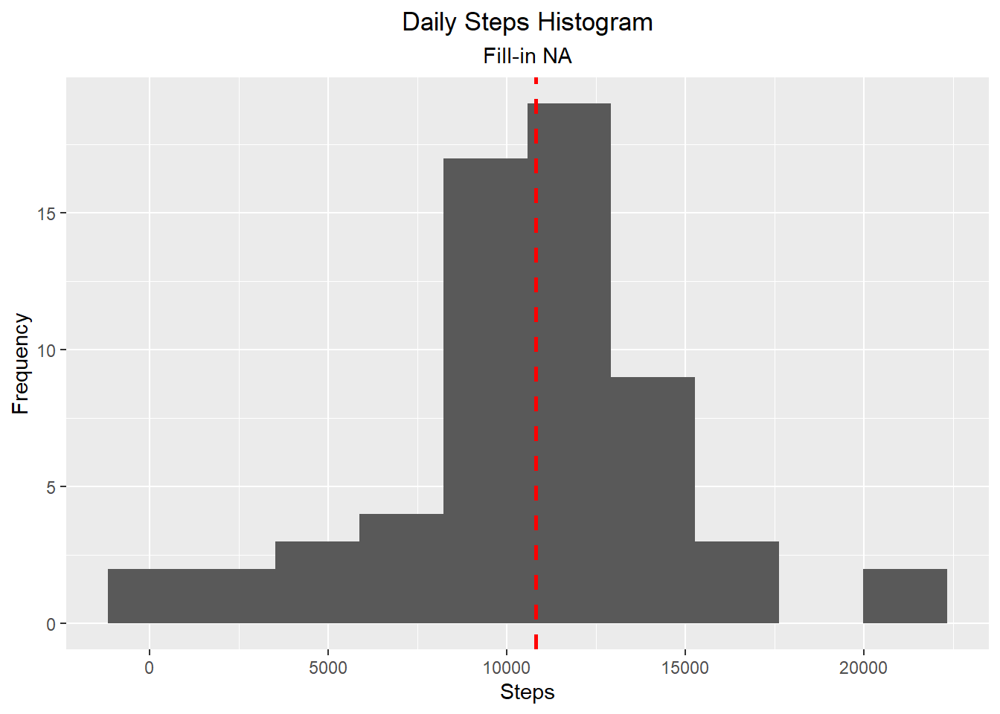

* &#x1f4da; Specialization: [Data Science: Foundations using R Specialization](https://www.coursera.org/specializations/data-science-foundations-r){target='_blank' rel='noopener'}
* &#x1f4d6; Course: [Reproducible Research](https://www.coursera.org/learn/reproducible-research){target='_blank' rel='noopener'}
    * &#x1F9D1;&#x200d;&#x1F3EB; Instructor: Roger D Peng
* &#x1F4C6; Week 2
    * &#x1F6A6; Start: Thursday, 23 June 2022
    * &#x1F3C1; Finish: Friday, 24 June 2022
* &#x1F4E6; Github Repository: [Static Document](https://github.com/AndersonUyekita/reproducible-research_course-project-1){target='_blank' rel='noopener'}

--------------------------------------------------------------------------------

## Sinopsis


--------------------------------------------------------------------------------

## Course Project 1

The Course Project 1 solution has five sections:

1. Loading and pre-processing the data;
2. What is mean total number of steps taken per day?;
3. What is the average daily activity pattern?;
4. Imputing missing values;
5. Are there differences in activity patterns between weekdays and weekends?.

**Packages Requirements**

It is necessary to install the following packages to reproduce this Course Project 2.


```r
# Loading libraries
library(ggplot2)
library(tidyverse)
library(magrittr)
library(kableExtra)
library(stringr)
library(lubridate)
```

Also, those following scripts will use the standard packages from R.

1. base
2. graphic
3. utils
4. grDevices

### 1. Loading and preprocessing the data

I have moved the `activity.zip`file to the data folder to make the repository root tidier.

#### 1.1. Load the data


```r
# Unzipping the compressed file
utils::unzip(zipfile = "./data/activity.zip",
             overwrite = TRUE,
             exdir = "./data/unzipped",
             list = FALSE)

# Loading the .csv file
raw_dataset <- utils::read.csv(file = "./data/unzipped/activity.csv",
                               header = TRUE)
```

Following the principles of Exploratory Data Analysis, let's dig into this dataset to analyze if it is necessary to make any adjustments. The first step is to know how many observations and variables this dataset has.


```r
# Printing the dimensions.
base::dim(raw_dataset) # Rows Columns
```

```
## [1] 17568     3
```

The database has 17.568 observations and 3 variables. It is aligned with the Course Project 1 instructions.

Now, I will check those variables because, according to the assignment instruction, those variables should be steps, date, and interval.


```r
# Print the column names.
base::colnames(raw_dataset)
```

```
## [1] "steps"    "date"     "interval"
```

The dataset has the expected variables and observations.

#### 1.2. Preprocessing the data

Initially, I will display the dataset summary (`summary()`) and then the structure (`str()`). It is necessary to have a big picture of the data in each variable because some data could be missing or wrongly classified/imported.


```r
# Printing the summary of each variables
summary(raw_dataset)
```

```
##      steps            date              interval     
##  Min.   :  0.00   Length:17568       Min.   :   0.0  
##  1st Qu.:  0.00   Class :character   1st Qu.: 588.8  
##  Median :  0.00   Mode  :character   Median :1177.5  
##  Mean   : 37.38                      Mean   :1177.5  
##  3rd Qu.: 12.00                      3rd Qu.:1766.2  
##  Max.   :806.00                      Max.   :2355.0  
##  NA's   :2304
```

```r
# Printing the dataset structure.
str(raw_dataset)
```

```
## 'data.frame':	17568 obs. of  3 variables:
##  $ steps   : int  NA NA NA NA NA NA NA NA NA NA ...
##  $ date    : chr  "2012-10-01" "2012-10-01" "2012-10-01" "2012-10-01" ...
##  $ interval: int  0 5 10 15 20 25 30 35 40 45 ...
```

As warned by the Course Project 1 instructions, the `steps` variable has 2304 `NA` and is classified as an integer, the `date` variable is wrongly imported as "character", and the `interval` has no `NA` and is classified as an integer.

It is necessary two steps:

1. Removing any observation with `NA`, and;
2. Converting the `date` column into a date class.


```r
# STEP 1 - Removing observations with NA.
aux_dataset <- base::subset(x = raw_dataset, !base::is.na(raw_dataset$steps))

# STEP 2 - Converting date column to Date class
tidy_dataset <- aux_dataset %>%
    dplyr::mutate(date = base::as.Date(date))

# Tidy dataset dimensions
base::dim(tidy_dataset)
```

```
## [1] 15264     3
```

The tidy dataset has 15.264 observations with the same 3 variables.


```r
# Printing the summary of each variables
summary(tidy_dataset)
```

```
##      steps             date               interval     
##  Min.   :  0.00   Min.   :2012-10-02   Min.   :   0.0  
##  1st Qu.:  0.00   1st Qu.:2012-10-16   1st Qu.: 588.8  
##  Median :  0.00   Median :2012-10-29   Median :1177.5  
##  Mean   : 37.38   Mean   :2012-10-30   Mean   :1177.5  
##  3rd Qu.: 12.00   3rd Qu.:2012-11-16   3rd Qu.:1766.2  
##  Max.   :806.00   Max.   :2012-11-29   Max.   :2355.0
```

```r
# Printing the dataset structure.
str(tidy_dataset)
```

```
## 'data.frame':	15264 obs. of  3 variables:
##  $ steps   : int  0 0 0 0 0 0 0 0 0 0 ...
##  $ date    : Date, format: "2012-10-02" "2012-10-02" ...
##  $ interval: int  0 5 10 15 20 25 30 35 40 45 ...
```

The `interval` variable is recorded weirdly because each observation has a length of 4. The first two characters represent the hour and the last two the minutes. I will convert this column into a period class from `lubridate` package.


```r
# Converting interval into Period Class.
tidy_dataset <- tidy_dataset %>%
    mutate(interval = str_pad(interval, 4, pad = "0")) %>%
    mutate(interval = paste0(substr(interval, 1, 2),":",substr(interval, 3, 4),":00")) %>%
    mutate(interval = lubridate::hms(interval))
```

Finally, the tidy dataset has no `NA`, the date column is correctly classified as a Date class and interval variable is a "time" variable.


```r
# Presenting the tidy dataset first rows.
head(tidy_dataset) %>%
    kableExtra::kbl() %>%
    kableExtra::kable_styling()
```

<table class="table" style="margin-left: auto; margin-right: auto;">
 <thead>
  <tr>
   <th style="text-align:left;">   </th>
   <th style="text-align:right;"> steps </th>
   <th style="text-align:left;"> date </th>
   <th style="text-align:right;"> interval </th>
  </tr>
 </thead>
<tbody>
  <tr>
   <td style="text-align:left;"> 289 </td>
   <td style="text-align:right;"> 0 </td>
   <td style="text-align:left;"> 2012-10-02 </td>
   <td style="text-align:right;"> 0S </td>
  </tr>
  <tr>
   <td style="text-align:left;"> 290 </td>
   <td style="text-align:right;"> 0 </td>
   <td style="text-align:left;"> 2012-10-02 </td>
   <td style="text-align:right;"> 5M 0S </td>
  </tr>
  <tr>
   <td style="text-align:left;"> 291 </td>
   <td style="text-align:right;"> 0 </td>
   <td style="text-align:left;"> 2012-10-02 </td>
   <td style="text-align:right;"> 10M 0S </td>
  </tr>
  <tr>
   <td style="text-align:left;"> 292 </td>
   <td style="text-align:right;"> 0 </td>
   <td style="text-align:left;"> 2012-10-02 </td>
   <td style="text-align:right;"> 15M 0S </td>
  </tr>
  <tr>
   <td style="text-align:left;"> 293 </td>
   <td style="text-align:right;"> 0 </td>
   <td style="text-align:left;"> 2012-10-02 </td>
   <td style="text-align:right;"> 20M 0S </td>
  </tr>
  <tr>
   <td style="text-align:left;"> 294 </td>
   <td style="text-align:right;"> 0 </td>
   <td style="text-align:left;"> 2012-10-02 </td>
   <td style="text-align:right;"> 25M 0S </td>
  </tr>
</tbody>
</table>

### 2. What is mean total number of steps taken per day?

The `tidy_dataset` has lines corresponding to a sample of 5 minutes of the day. If everything is correct, each day must have 288 observations.


```r
# Checking if each day has 288 observations.
tidy_dataset %>%
    dplyr::group_by(date) %>%
    dplyr::summarise(obs_day = dplyr::n()) %>%  # Count the number of observations per day.
    dplyr::select(obs_day) %>%
    unique() %>%
    as.numeric()
```

```
## [1] 288
```

As you can see, all days have the same quantity of observations (288), allowing me to make further analyses using all observations of `tidy_dataset`.

#### 2.1. Calculate the total number of steps taken per day

Now, it is necessary to `aggregate` the rows of the same day to calculate a dataset based on days.


```r
# Calculating the number of steps in a day.
tidy_dataset_day <- tidy_dataset %>%
    dplyr::group_by(date) %>%
    dplyr::summarise(steps = sum(steps))

# ALTERNATIVE - Using the aggregate function
# tidy_dataset_day <- stats::aggregate(steps ~ date, data = tidy_dataset, FUN = sum)
```

According to the `tidy_dataset` there are 53 days in this dataset, so the `tidy_dataset_day` must have 53 rows.


```r
# Number of rows
base::nrow(tidy_dataset_day)
```

```
## [1] 53
```

The `tidy_dataset_day` has 53 observations and 2 columns (`date` and `steps`). The scatter plot below will show the distribution of daily steps between 2012-10-02 and 2012-11-29.


```r
# Plotting a scatter plot using ggplot2.
ggplot2::ggplot(data = tidy_dataset_day,
                aes(x = date,
                    y = steps)) + 
    
    # Scatter plot
    geom_point() +
    
    # Adding Loess Regression 
    geom_smooth(formula = y ~ x,
                orientation = "x",
                method = 'loess',
                lwd = 0.75,
                aes(color = "Loess")) + 
    
    # Adding a horizontal line to show the Average
    geom_hline(yintercept = mean(tidy_dataset_day$steps),
               linetype = "dashed",
               color = "red",
               lwd = 1,
               aes(color = "Average")) +
    
    # Adding manually the legend.
    scale_color_manual(name = '',
                     breaks = c('Loess', 'Average'),
                     values = c('Loess' = 'blue', 'Average' = 'red')) + 
    
    # Defining the Plot title, x-axis label and y-axis label.
    labs(title = "Time Series of Steps") + 
    xlab(label = "Day") +
    ylab(label = "Daily Steps") +
    
    # Setting legend and title positions.
    theme(legend.position = "bottom",
          plot.title = element_text(hjust = 0.5))
```

<!-- -->

#### 2.2. Make a histogram of the total number of steps taken each day

Based on `tidy_dataset_day`, the histogram below presents the daily steps habits.


```r
# Plotting a ggplot2 histogram.
ggplot2::ggplot(data = tidy_dataset_day,
                aes(x = steps)) + 
    
    # Creating a histogram with 10 bins.
    geom_histogram(bins = 10) + 
    
    # Adding the Average
    geom_vline(xintercept = mean(tidy_dataset_day$steps),
               linetype = "dashed",
               color = "red",
               lwd = 1.0,
               aes(color = "Average")) + 
    
    # Defining the Plot title, x-axis label and y-axis label.
    labs(title = "Daily Steps Histogram") + 
    xlab(label = "Steps") +
    ylab(label = "Frequency") +
    
    # Setting legend and title positions.
    theme(legend.position = "right",
          plot.title = element_text(hjust = 0.5))
```

<!-- -->

According to the above histogram, the most common daily steps varies between 10.000 and 15.000 thousand steps.

#### 2.3. Calculate the mean and median of daily steps.

The `summary` show the mean and median of daily `steps`.


```r
# Summary of steps
summary(tidy_dataset_day) %>%
    kableExtra::kbl() %>%
    kableExtra::kable_styling()
```

<table class="table" style="margin-left: auto; margin-right: auto;">
 <thead>
  <tr>
   <th style="text-align:left;">   </th>
   <th style="text-align:left;">      date </th>
   <th style="text-align:left;">     steps </th>
  </tr>
 </thead>
<tbody>
  <tr>
   <td style="text-align:left;">  </td>
   <td style="text-align:left;"> Min.   :2012-10-02 </td>
   <td style="text-align:left;"> Min.   :   41 </td>
  </tr>
  <tr>
   <td style="text-align:left;">  </td>
   <td style="text-align:left;"> 1st Qu.:2012-10-16 </td>
   <td style="text-align:left;"> 1st Qu.: 8841 </td>
  </tr>
  <tr>
   <td style="text-align:left;">  </td>
   <td style="text-align:left;"> Median :2012-10-29 </td>
   <td style="text-align:left;"> Median :10765 </td>
  </tr>
  <tr>
   <td style="text-align:left;">  </td>
   <td style="text-align:left;"> Mean   :2012-10-30 </td>
   <td style="text-align:left;"> Mean   :10766 </td>
  </tr>
  <tr>
   <td style="text-align:left;">  </td>
   <td style="text-align:left;"> 3rd Qu.:2012-11-16 </td>
   <td style="text-align:left;"> 3rd Qu.:13294 </td>
  </tr>
  <tr>
   <td style="text-align:left;">  </td>
   <td style="text-align:left;"> Max.   :2012-11-29 </td>
   <td style="text-align:left;"> Max.   :21194 </td>
  </tr>
</tbody>
</table>

Finally, the daily steps mean and median:

* Mean = 10766
* Median = 10765

### 3. What is the average daily activity pattern?

The `interval` variable is responsible for tracking the daily activity pattern. For this reason, I will use it to create a new dataset of daily activity pattern.


```r
# Calculating the number of steps in a day.
tidy_dataset_day_pattern <- tidy_dataset %>%
    dplyr::group_by(interval) %>%
    dplyr::summarise(steps = mean(steps))

# ALTERNATIVE - Using the aggregate function
# tidy_dataset_day_pattern <- base::aggregate(steps ~ interval, data = tidy_dataset, FUN = sum)
```

Let's check how is the dataset after the average. I will display the last rows.


```r
# Presenting the Daily Pattern last rows.
tail(tidy_dataset_day_pattern) %>%
    kableExtra::kbl() %>%
    kableExtra::kable_styling()
```

<table class="table" style="margin-left: auto; margin-right: auto;">
 <thead>
  <tr>
   <th style="text-align:right;"> interval </th>
   <th style="text-align:right;"> steps </th>
  </tr>
 </thead>
<tbody>
  <tr>
   <td style="text-align:right;"> 23H 30M 0S </td>
   <td style="text-align:right;"> 138 </td>
  </tr>
  <tr>
   <td style="text-align:right;"> 23H 35M 0S </td>
   <td style="text-align:right;"> 249 </td>
  </tr>
  <tr>
   <td style="text-align:right;"> 23H 40M 0S </td>
   <td style="text-align:right;"> 175 </td>
  </tr>
  <tr>
   <td style="text-align:right;"> 23H 45M 0S </td>
   <td style="text-align:right;"> 34 </td>
  </tr>
  <tr>
   <td style="text-align:right;"> 23H 50M 0S </td>
   <td style="text-align:right;"> 12 </td>
  </tr>
  <tr>
   <td style="text-align:right;"> 23H 55M 0S </td>
   <td style="text-align:right;"> 57 </td>
  </tr>
</tbody>
</table>

#### 3.1. Make a time series plot of the 5-minute interval (x-axis) and the average number of steps taken, averaged across all days (y-axis)

The line plot below presents the average daily steps in each interval.


```r
tidy_dataset_day_pattern %>%
    mutate(interval = hms::hms(interval)) %>%

ggplot(aes(x = interval, y = steps)) + 
    geom_rect(aes(xmin = -Inf,
                  xmax = hms::hms(lubridate::hms("06:00:00")),
                  ymin= -Inf,
                  ymax = Inf), fill = "lightblue", alpha = 0.015) + 
    
    geom_rect(aes(xmin = hms::hms(lubridate::hms("06:00:00")),
                  xmax = hms::hms(lubridate::hms("18:00:00")),
                  ymin= -Inf,
                  ymax = Inf), fill = "yellow", alpha = 0.015) +
    
    geom_rect(aes(xmin = hms::hms(lubridate::hms("18:00:00")),
                  xmax = Inf,
                  ymin= -Inf,
                  ymax = Inf), fill = "lightblue", alpha = 0.015) +   
    
    geom_line() + 
    geom_point() +
    scale_x_time(breaks = c(hms::hms(lubridate::hms("00:00:00")),
                                           hms::hms(lubridate::hms("06:00:00")),
                                           hms::hms(lubridate::hms("12:00:00")),
                                           hms::hms(lubridate::hms("18:00:00")),
                                           hms::hms(lubridate::hms("24:00:00")))) + 

    # Defining the Plot title, x-axis label and y-axis label.
    labs(title = "Time Serie of Daily Interval Steps Average") + 
    xlab(label = "Interval") +
    ylab(label = "Steps Average") +
    
    # Setting legend and title positions.
    theme(plot.title = element_text(hjust = 0.5))
```

<!-- -->

The person tracked has an explicit behavior to wake up around 5 AM, between 7 AM and 10 AM has the peak of steps (maybe the commute to work), around mid-day another rise which could be the trajectory to lunch.

#### 3.2. Which 5-minute interval, on average across all the days in the dataset, contains the maximum number of steps?

Let's filter the `tidy_dataset_day_pattern` to obtain the highest steps average and find when it happens.


```r
# 
tidy_dataset_day_pattern %>%
    filter(steps == max(steps)) %>%
    kableExtra::kbl() %>%
    kableExtra::kable_styling()
```

<table class="table" style="margin-left: auto; margin-right: auto;">
 <thead>
  <tr>
   <th style="text-align:right;"> interval </th>
   <th style="text-align:right;"> steps </th>
  </tr>
 </thead>
<tbody>
  <tr>
   <td style="text-align:right;"> 8H 35M 0S </td>
   <td style="text-align:right;"> 206.1698 </td>
  </tr>
</tbody>
</table>

The highest steps average is 206.17, and it occurs at 08:35 AM.

### 4. Imputing missing values


#### Calculate and report the total number of missing values in the dataset (i.e. the total number of rows with NAs) 

According to the `summary()`, the steps variables has 2304 `NA` observations.


```r
summary(raw_dataset)
```

```
##      steps            date              interval     
##  Min.   :  0.00   Length:17568       Min.   :   0.0  
##  1st Qu.:  0.00   Class :character   1st Qu.: 588.8  
##  Median :  0.00   Mode  :character   Median :1177.5  
##  Mean   : 37.38                      Mean   :1177.5  
##  3rd Qu.: 12.00                      3rd Qu.:1766.2  
##  Max.   :806.00                      Max.   :2355.0  
##  NA's   :2304
```


```r
sum(is.na(raw_dataset$steps))
```

```
## [1] 2304
```

#### Devise a strategy for filling in all of the missing values in the dataset. The strategy does not need to be sophisticated. For example, you could use the mean/median for that day, or the mean for that 5-minute interval, etc.


```r
tidy_dataset_2 <- raw_dataset %>%
    dplyr::mutate(date = base::as.Date(date)) %>%
    mutate(weekday = weekdays(date)) %>%
    mutate(interval = str_pad(interval, 4, pad = "0")) %>%
    mutate(interval = paste0(substr(interval, 1, 2),":",substr(interval, 3, 4),":00")) %>%
    mutate(interval = hms::hms(lubridate::hms(interval)))

avg_weekday <- tidy_dataset_2 %>%
    group_by(weekday, interval) %>%
    summarise(average = mean(steps,na.rm = TRUE))

avg_weekday
```

```
## # A tibble: 2,016 x 3
## # Groups:   weekday [7]
##    weekday interval average
##    <chr>   <time>     <dbl>
##  1 Friday  00'00"         0
##  2 Friday  05'00"         0
##  3 Friday  10'00"         0
##  4 Friday  15'00"         0
##  5 Friday  20'00"         0
##  6 Friday  25'00"         0
##  7 Friday  30'00"         0
##  8 Friday  35'00"         0
##  9 Friday  40'00"         0
## 10 Friday  45'00"         0
## # ... with 2,006 more rows
```


#### Create a new dataset that is equal to the original dataset but with the missing data filled in.


```r
merge(x = tidy_dataset_2,y = avg_weekday,by = c("interval", "weekday")) %>%
    arrange(date) %>%
    mutate(steps = coalesce(steps,average)) -> fim

summary(fim)
```

```
##    interval          weekday              steps             date           
##  Length:17568      Length:17568       Min.   :  0.00   Min.   :2012-10-01  
##  Class1:hms        Class :character   1st Qu.:  0.00   1st Qu.:2012-10-16  
##  Class2:difftime   Mode  :character   Median :  0.00   Median :2012-10-31  
##  Mode  :numeric                       Mean   : 37.57   Mean   :2012-10-31  
##                                       3rd Qu.: 19.04   3rd Qu.:2012-11-15  
##                                       Max.   :806.00   Max.   :2012-11-30  
##     average      
##  Min.   :  0.00  
##  1st Qu.:  0.00  
##  Median : 12.57  
##  Mean   : 37.57  
##  3rd Qu.: 55.43  
##  Max.   :328.57
```


#### Make a histogram of the total number of steps taken each day and Calculate and report the mean and median total number of steps taken per day. Do these values differ from the estimates from the first part of the assignment? What is the impact of imputing missing data on the estimates of the total daily number of steps?


```r
fim %>% group_by(date) %>%
    summarise(steps = sum(steps)) -> fim_2


fim_2 %>%

# Plotting a ggplot2 histogram.
ggplot2::ggplot(aes(x = steps)) + 
    
    # Creating a histogram with 10 bins.
    geom_histogram(bins = 10) + 
    
    # Adding the Average
    geom_vline(xintercept = mean(fim_2$steps),
               linetype = "dashed",
               color = "red",
               lwd = 1.0,
               aes(color = "Average")) + 
    
    # Defining the Plot title, x-axis label and y-axis label.
    labs(title = "Daily Steps Histogram") + 
    xlab(label = "Steps") +
    ylab(label = "Frequency") +
    
    # Setting legend and title positions.
    theme(legend.position = "right",
          plot.title = element_text(hjust = 0.5))
```

<!-- -->


```r
summary(fim_2)
```

```
##       date                steps      
##  Min.   :2012-10-01   Min.   :   41  
##  1st Qu.:2012-10-16   1st Qu.: 8918  
##  Median :2012-10-31   Median :11015  
##  Mean   :2012-10-31   Mean   :10821  
##  3rd Qu.:2012-11-15   3rd Qu.:12811  
##  Max.   :2012-11-30   Max.   :21194
```


### 5. Are there differences in activity patterns between weekdays and weekends?

#### 5.1. Create a new factor variable in the dataset with two levels – “weekday” and “weekend” indicating whether a given date is a weekday or weekend day.


```r
fim %>%
    mutate(day_type = case_when(
        weekday %in% c("Friday", "Saturday") ~ "Weekend",
        !(weekday %in% c("Friday", "Saturday")) ~ "Weekday"
    )) -> fim_3
```


#### 5.2. Make a panel plot containing a time series plot (i.e. \color{red}{\verb|type = "l"|}type = "l") of the 5-minute interval (x-axis) and the average number of steps taken, averaged across all weekday days or weekend days (y-axis). See the README file in the GitHub repository to see an example of what this plot should look like using simulated data.


```r
fim_3 %>% 
    group_by(interval, day_type) %>%
    summarise(steps = mean(steps)) %>%

ggplot(aes(x = interval, y = steps)) + 
    geom_point() + 
    geom_line() +
    facet_grid(rows = vars(day_type))
```

<!-- -->
